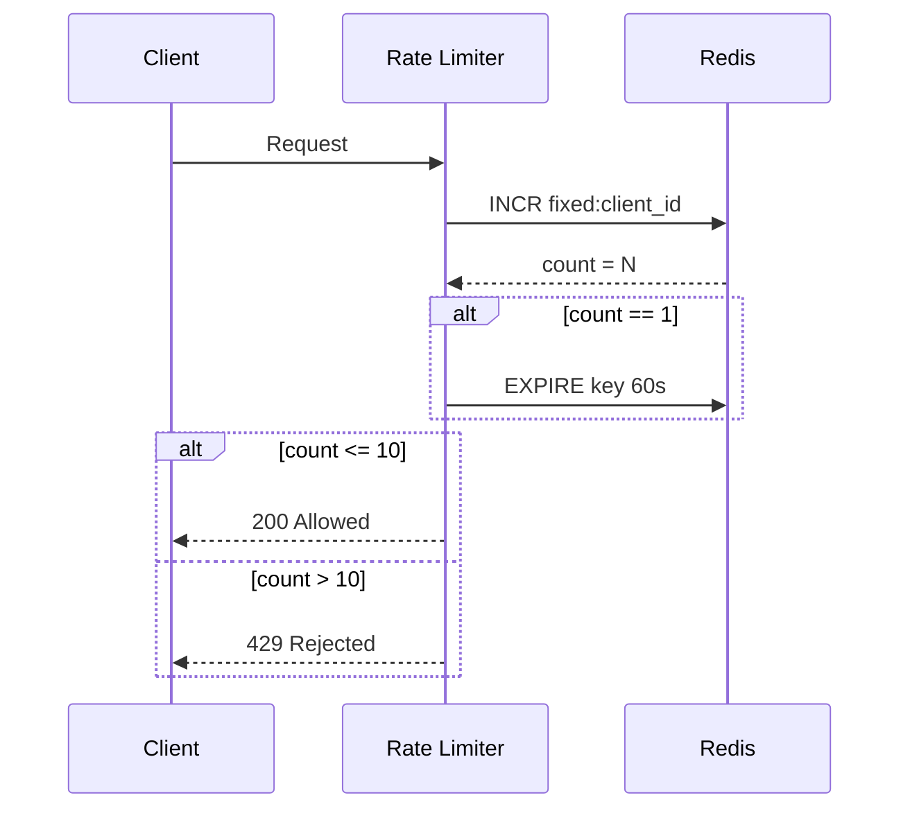
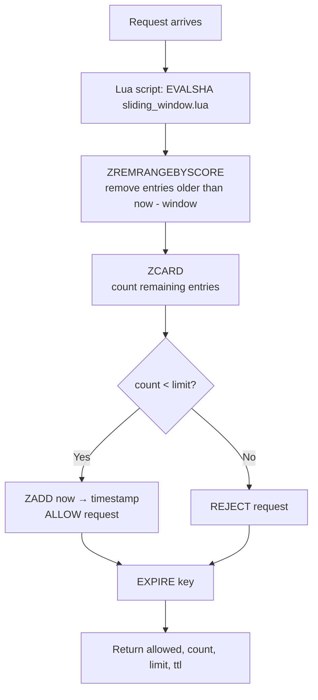
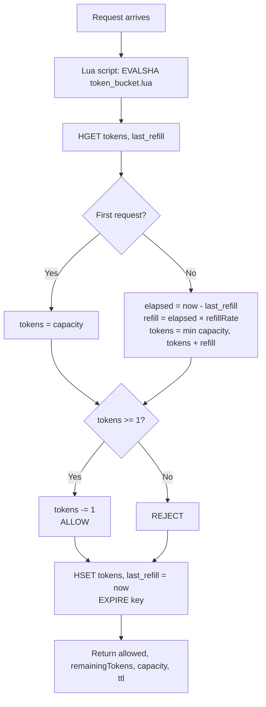
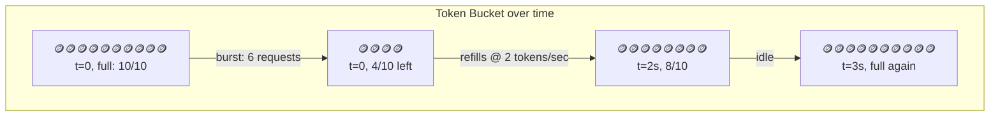
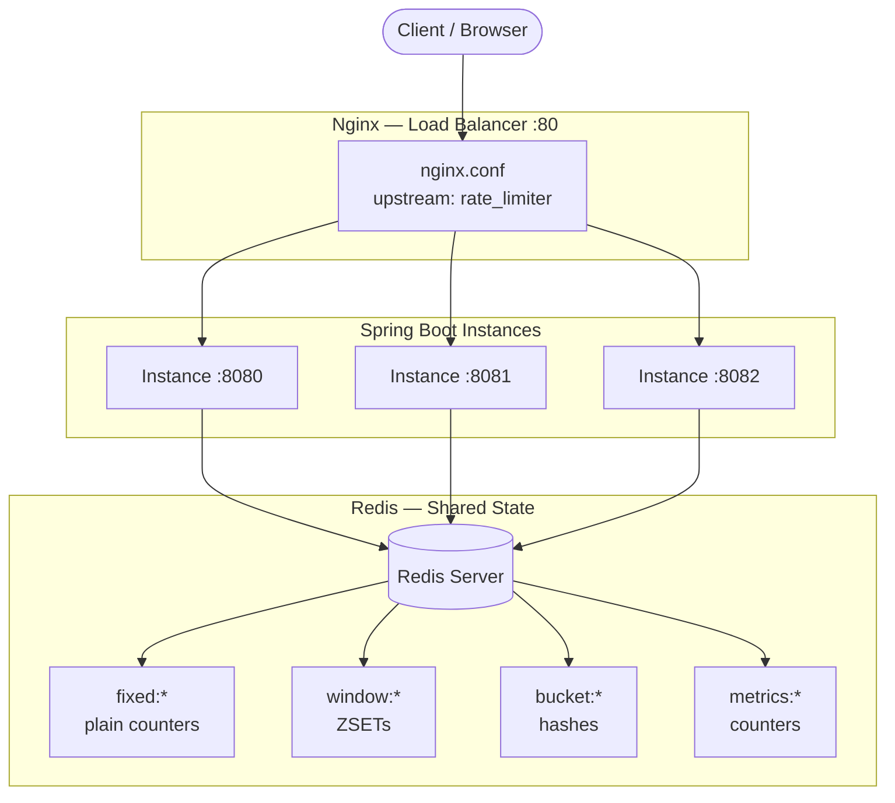
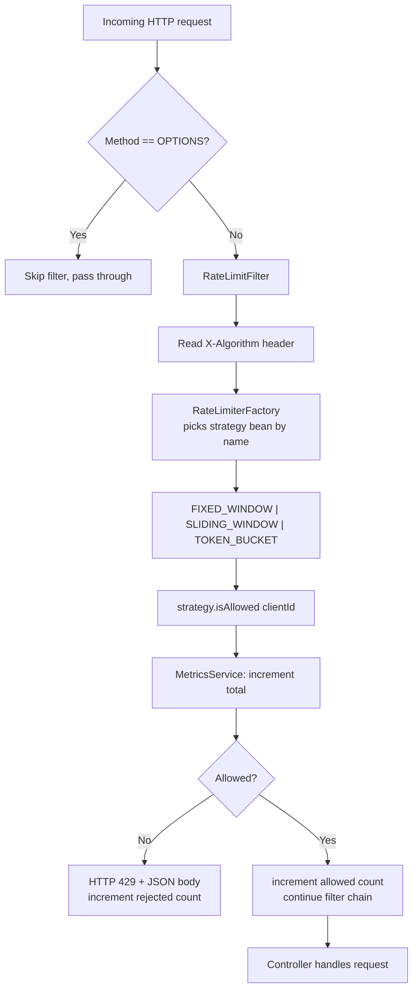

# 🚦 Distributed Rate Limiter

A Spring Boot rate limiter that started as a single algorithm and grew into a pluggable, Redis-backed rate limiting engine running behind an Nginx load balancer — with **Fixed Window**, **Sliding Window Log**, and **Token Bucket** algorithms, switchable at runtime.

---

## 📖 The Story Behind This Project

Rate limiting looks trivial until you actually try to make it correct, distributed, and fast. This repo is a record of that journey — I didn't jump straight to the "best" solution, I built each algorithm, felt its pain points, and used that pain to justify the next one.

### 1️⃣ First attempt — Fixed Window Counter

The obvious first idea: keep a counter per client, reset it every 60 seconds.



**Why it's simple:** one Redis `INCR` + one `EXPIRE`, done. Easy to reason about, cheap to run.

**Why it's flawed — the boundary burst problem:**

```mermaid
gantt
    dateFormat X
    axisFormat %Ls
    title Burst at the window edge (limit = 10/min)

    section Window 1 (0-60s)
    10 requests allowed near t=59s :active, w1, 0, 60
    section Window 2 (60-120s)
    10 more requests allowed at t=60s :crit, w2, 60, 120
```



A client can fire 10 requests at `t=59s` and another 10 at `t=61s` — **20 requests in 2 seconds**, even though the limit is "10 per minute." The fixed window resets abruptly instead of *sliding*, so traffic clustered around the boundary slips through. That flaw is what motivated the next iteration.

### 2️⃣ Second attempt — Sliding Window Log

To kill the boundary-burst problem, I moved from a simple counter to a **Redis Sorted Set (ZSET)** that logs the timestamp of every request. On each call, a Lua script atomically trims anything older than the window and checks how many timestamps remain.



**Why it's better:** the window is truly continuous — it always looks at "the last 60 seconds from *right now*," not a fixed clock boundary. No more edge-of-window bursts.

**Why it still has a cost:** every request stores its own entry in the ZSET, so memory grows with request volume, and a high-traffic client can produce a large log to trim on every call. That's the tradeoff that pushed me toward a lighter-weight, smoother algorithm.

### 3️⃣ Final iteration — Token Bucket

The current default. Instead of counting raw requests in a window, each client owns a **bucket of tokens** that refills continuously over time. A request is allowed only if a token is available, and it consumes one.





**Why this is the final pick:**
- **Smooths bursts** instead of hard-cutting them — a client can spend saved-up tokens on a short burst, then has to wait for a refill, which matches how real APIs want to behave.
- **O(1) memory per client** (one hash, two fields) instead of a growing log.
- **Continuous refill** driven by elapsed time, calculated *inside* the atomic Lua script, so there's no polling or background job needed.

Each algorithm still lives in the codebase behind a common interface, so any of the three can be selected per-request via a header — useful for demos and for comparing behavior side by side.

---

## 🏗️ System Architecture



Because the algorithm state lives in **Redis**, not in each instance's memory, the rate limit is enforced correctly no matter which of the three Spring Boot instances Nginx routes a given request to. That's the core reason Redis + Lua scripts (for atomicity) were chosen over an in-memory counter.

---

## 🔄 Request Lifecycle

Every request passes through a single servlet filter before it ever reaches a controller:



This is a classic **Strategy + Factory** combination:
- `RateLimiter` — interface implemented by all three algorithms
- `FixedWindowRateLimiter`, `SlidingWindowRateLimiter`, `TokenBucketRateLimiter` — Spring `@Component`s, each registered under a bean name (`FIXED_WINDOW`, `SLIDING_WINDOW`, `TOKEN_BUCKET`)
- `RateLimiterFactory` — Spring auto-injects **all** `RateLimiter` beans into a `Map<String, RateLimiter>`, so picking a strategy at runtime is just a map lookup by the `X-Algorithm` header value

---

## 📦 Tech Stack

| Layer | Technology |
|---|---|
| Language / Framework | Java 17, Spring Boot |
| State store | Redis (atomic ops via Lua scripts) |
| Load balancing | Nginx (3-instance upstream) |
| Build | Maven |
| Boilerplate reduction | Lombok |

---

## 📂 Project Structure

```
rate-limiter/
├── src/main/java/com/example/rate_limiter/
│   ├── strategy/
│   │   ├── RateLimiter.java              # common interface
│   │   ├── FixedWindowRateLimiter.java   # v1: simple counter
│   │   ├── SlidingWindowRateLimiter.java # v2: ZSET log
│   │   └── TokenBucketRateLimiter.java   # v3: bucket + refill
│   ├── factory/
│   │   └── RateLimiterFactory.java       # runtime strategy lookup
│   ├── filter/
│   │   └── RateLimitFilter.java          # intercepts every request
│   ├── redis/
│   │   └── RedisConfig.java              # registers Lua scripts
│   ├── service/
│   │   ├── AlgorithmService.java         # tracks active algorithm
│   │   └── MetricsService.java           # allowed/rejected counters
│   ├── controller/
│   │   ├── AlgorithmController.java      # GET/POST /api/config/algorithm
│   │   └── MetricsController.java        # GET /api/metrics
│   ├── dto/
│   │   ├── RateLimitResponse.java
│   │   ├── MetricsResponse.java
│   │   └── AlgorithmRequest.java
│   └── config/
│       └── CorsConfig.java
├── src/main/resources/
│   ├── lua/
│   │   ├── token_bucket.lua
│   │   └── sliding_window.lua
│   └── application.properties
├── nginx.conf                             # 3-instance upstream on :80
└── pom.xml
```

---

## 🔌 API Reference

| Method | Endpoint | Description |
|---|---|---|
| `GET` | `/api/config/algorithm` | Get the currently active algorithm |
| `POST` | `/api/config/algorithm` | Set the active algorithm (`FIXED_WINDOW`, `SLIDING_WINDOW`, `TOKEN_BUCKET`) |
| `GET` | `/api/config/test` | Inspect the rate limit result of the last request |
| `GET` | `/api/metrics` | Total / allowed / rejected request counts |

Any request can also select a strategy directly via header:

```bash
curl -H "X-Algorithm: TOKEN_BUCKET" http://localhost:8080/api/config/test
```

---

## 🚀 Running Locally

**1. Start Redis**
```bash
docker run -p 6379:6379 redis
```

**2. Run the app**
```bash
./mvnw spring-boot:run
```

**3. (Optional) Run the 3-instance cluster behind Nginx**
```bash
./mvnw spring-boot:run -Dspring-boot.run.arguments=--server.port=8080
./mvnw spring-boot:run -Dspring-boot.run.arguments=--server.port=8081
./mvnw spring-boot:run -Dspring-boot.run.arguments=--server.port=8082

nginx -c $(pwd)/nginx.conf
# App now reachable via http://localhost
```

---

## 📊 Algorithm Comparison

| | Fixed Window | Sliding Window Log | Token Bucket |
|---|---|---|---|
| Redis structure | `String` counter | `ZSET` (sorted set) | `Hash` |
| Memory per client | O(1) | O(requests in window) | O(1) |
| Boundary burst issue | ❌ Yes | ✅ Fixed | ✅ Fixed |
| Allows short bursts | ❌ No | ❌ No | ✅ Yes, up to bucket capacity |
| Complexity | Low | Medium | Medium |
| Used as default | | | ✅ |

---

## 🔮 Future Improvements

- [ ] Per-endpoint rate limits (not just per-client)
- [ ] Sliding Window *Counter* (hybrid of fixed window + weighted overlap) as a lighter alternative to the log-based version
- [ ] Dashboard (Angular) consuming `/api/metrics` in real time
- [ ] Configurable limits via `application.properties` instead of hardcoded constants
